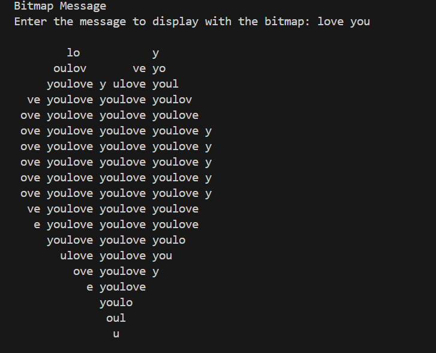

# Bitmap Message Display

This Python script displays a bitmap message along with a user-provided message. It prompts the user to enter a message and overlays it on a predefined bitmap image using list comprehensions for concise and efficient code.

## Usage
1. Clone the repository to your local machine.
2. Make sure you have Python installed.
3. Run the script using the command: `python bitmap_message.py`.
4. Follow the on-screen instructions to enter your message.

## Example

## Contributing
Contributions are welcome! If you find any issues or have suggestions for improvement, please feel free to open an issue or submit a pull request.

## License
This project is licensed under the MIT License. See the [LICENSE](LICENSE) file for details.
